<p align="center">
  
  
  
  
  
</p>

<h1 align="center">🏥 SwasthID — Pipeline 2</h1>
<h3 align="center">AI-Powered Medical Imaging Analysis System</h3>
<h4 align="center"><em>"One Nation, One Health Identity"</em> • स्वस्थ ID</h4>

<p align="center">
  <strong>🔴 LIVE:</strong> <a href="https://vitalscan-med-ai.azurewebsites.net">vitalscan-med-ai.azurewebsites.net</a>
</p>

<p align="center">
  <a href="#-the-problem">Problem</a> •
  <a href="#-solution-architecture">Architecture</a> •
  <a href="#-features">Features</a> •
  <a href="#-api-reference">API</a> •
  <a href="#-quick-start">Quick Start</a> •
  <a href="#-deployment">Deployment</a>
</p>

---

## 📖 Table of Contents

- [The Problem](#-the-problem)
- [Our Solution](#-our-solution)
- [Key Differentiators](#-key-differentiators-why-swasthid)
- [System Architecture](#-system-architecture)
- [Features](#-features)
- [Technical Stack](#-technical-stack)
- [API Reference](#-api-reference)
- [Quick Start](#-quick-start)
- [Project Structure](#-project-structure)
- [Deployment](#-deployment-azure)
- [Datasets & Validation](#-datasets--validation)
- [Roadmap](#-roadmap)
- [Team](#-team)
- [License & Disclaimer](#-license--disclaimer)

---

## 😰 The Problem

> *"6 hospitalizations. 4 surgeries. 12 specialists. Every single time — I start from zero. No doctor knows my history. I am just another file number."*
> 
> — **Udita Uniyal**, Co-founder & Patient

### India's Healthcare Data Crisis

```mermaid
mindmap
  root((🇮🇳 India's Healthcare Crisis))
    📊 Scale
      1.4B without unified records
      600M+ ABHA IDs created
      ₹83,000 Cr annual loss
    ⏰ Time Wasted
      4+ hour wait times
      3-day diagnosis cycles
      70% time on paperwork
    📁 Fragmentation
      50+ pages per visit
      Records lost between hospitals
      No complete health picture
    💔 Patient Impact
      Repeat tests everywhere
      Doctors start from zero
      Critical info gets lost
```

---

## 💡 Our Solution

**SwasthID** is an AI-powered unified medical identity platform that transforms fragmented healthcare data into a single, intelligent health identity.

### Solution Flow

```mermaid
flowchart LR
    subgraph INPUT["📤 INPUT"]
        A[("🩻 Medical Scan\n(X-ray, Ultrasound, MRI)")]
    end
    
    subgraph PROCESSING["🤖 AI PROCESSING"]
        B["GPT-4o Vision\nAnalysis"]
        C["Finding\nExtraction"]
        D["Report\nGeneration"]
    end
    
    subgraph OUTPUT["📋 OUTPUT"]
        E[("📊 Diagnosis +\nPDF Report")]
    end
    
    subgraph UNIFIED["🆔 UNIFIED IDENTITY"]
        F[("SwasthID\nHealth Record")]
    end
    
    A --> B --> C --> D --> E
    E --> F
    
    style A fill:#e1f5fe
    style B fill:#fff3e0
    style C fill:#fff3e0
    style D fill:#fff3e0
    style E fill:#e8f5e9
    style F fill:#fce4ec
```

### The Vision

```mermaid
graph TB
    subgraph TODAY["😰 TODAY: Fragmented"]
        H1["🏥 Hospital A"] --> P1["📁 File 1"]
        H2["🏥 Hospital B"] --> P2["📁 File 2"]
        H3["🏥 Hospital C"] --> P3["📁 File 3"]
        P1 & P2 & P3 --> PATIENT["😵 Patient carries\n50+ pages"]
    end
    
    subgraph FUTURE["😊 FUTURE: SwasthID"]
        HA["🏥 Any Hospital"] --> SWASTH["🆔 SwasthID"]
        SWASTH --> DOC["👨‍⚕️ Doctor sees\nEVERYTHING"]
    end
    
    TODAY -.->|"SwasthID\nTransformation"| FUTURE
    
    style SWASTH fill:#4caf50,color:#fff
    style PATIENT fill:#f44336,color:#fff
    style DOC fill:#2196f3,color:#fff
```

---

## 🎯 Key Differentiators: Why SwasthID?


| Feature | Paper Records | Hospital EHRs | Practo/1mg | ABHA (Govt) | **SwasthID** |
|---------|:-------------:|:-------------:|:----------:|:-----------:|:------------:|
| Unified ID | ❌ | ❌ | ❌ | ✅ | ✅ |
| AI Scan Analysis | ❌ | ❌ | ❌ | ❌ | ✅ |
| Cross-Hospital | ❌ | ❌ | ⚠️ | ✅ | ✅ |
| Auto PDF Reports | ❌ | ❌ | ❌ | ❌ | ✅ |
| ABHA Integration | ❌ | ⚠️ | ⚠️ | ✅ | ✅ |

> **"ABHA created the rails. SwasthID runs the train."**

---

## 🏗 System Architecture

### High-Level Architecture

```mermaid
flowchart TB
    subgraph CLIENT["🖥️ CLIENT LAYER"]
        WEB["🌐 Web App"]
        MOBILE["📱 Mobile App\n(Future)"]
        HOSPITAL["🏥 Hospital Portal"]
        API_CLIENT["🔌 API Consumers"]
    end
    
    subgraph GATEWAY["🚪 API GATEWAY"]
        FASTAPI["⚡ FastAPI Server"]
        
        subgraph ROUTES["Routes"]
            R1["/health"]
            R2["/analyze"]
            R3["/analyze/breast-ultrasound"]
            R4["/analyze/pcos"]
            R5["/report/generate"]
        end
    end
    
    subgraph INTELLIGENCE["🧠 INTELLIGENCE LAYER"]
        subgraph RAG["Multi-Modal RAG Pipeline"]
            INTAKE["📥 Image\nIntake"]
            ROUTER["🔀 Scan Type\nRouter"]
            VISION["👁️ GPT-4o\nVision"]
            EXTRACT["📝 Finding\nExtractor"]
        end
        
        subgraph DOMAIN["Domain Knowledge"]
            BIRADS["BI-RADS\nScoring"]
            ROTTERDAM["Rotterdam\nCriteria"]
            RADIO["Radiological\nTerminology"]
        end
        
        subgraph OUTPUT_FMT["Output Formatting"]
            JSON_OUT["JSON\nResponse"]
            PDF_GEN["PDF\nGenerator"]
            CONF["Confidence\nScoring"]
        end
    end
    
    subgraph AZURE["☁️ AZURE CLOUD"]
        AOAI["🤖 Azure OpenAI\n(GPT-4o)"]
        WEBAPP["🌐 Azure Web Apps"]
        BLOB["📦 Azure Blob\nStorage"]
    end
    
    CLIENT --> GATEWAY
    GATEWAY --> INTELLIGENCE
    INTELLIGENCE --> AZURE
    
    INTAKE --> ROUTER --> VISION --> EXTRACT
    DOMAIN --> VISION
    EXTRACT --> OUTPUT_FMT
    
    style FASTAPI fill:#009688,color:#fff
    style VISION fill:#412991,color:#fff
    style AOAI fill:#0078D4,color:#fff
```

### Request-Response Flow

```mermaid
sequenceDiagram
    autonumber
    participant U as 👤 User
    participant F as 🌐 Frontend
    participant A as ⚡ FastAPI
    participant G as 🤖 GPT-4o Vision
    participant P as 📄 PDF Generator
    
    U->>F: Upload Medical Scan
    F->>A: POST /analyze (multipart/form-data)
    
    rect rgb(240, 248, 255)
        Note over A: Image Processing
        A->>A: Base64 Encode Image
        A->>A: Detect Scan Type
        A->>A: Build Medical Prompt
    end
    
    A->>G: Send Image + Prompt
    
    rect rgb(255, 248, 240)
        Note over G: AI Analysis
        G->>G: Visual Feature Extraction
        G->>G: Medical Pattern Recognition
        G->>G: Generate Findings
    end
    
    G-->>A: Structured Analysis Response
    
    rect rgb(240, 255, 240)
        Note over A: Response Formatting
        A->>A: Parse Findings
        A->>A: Calculate Confidence
        A->>A: Format JSON
    end
    
    A-->>F: JSON Response
    F-->>U: Display Results
    
    opt Generate PDF Report
        U->>F: Request PDF Report
        F->>A: POST /report/generate
        A->>P: Generate PDF
        P-->>A: PDF Buffer
        A-->>F: PDF Download
        F-->>U: Download Report
    end
```

### Component Interaction


---

## ✨ Features

### 🔬 Medical Scan Analysis Pipeline

```mermaid
flowchart LR
    subgraph SCANS["Supported Scans"]
        S1["🩻 Breast\nUltrasound"]
        S2["🩻 Pelvic\nUltrasound"]
        S3["🩻 Chest\nX-Ray"]
        S4["🩻 General\nScan"]
    end
    
    subgraph ANALYSIS["AI Analysis"]
        A1["BI-RADS\n1-5 Scoring"]
        A2["Rotterdam\nCriteria"]
        A3["Pneumonia\nDetection"]
        A4["Auto\nClassification"]
    end
    
    subgraph OUTPUT["Outputs"]
        O1["Classification"]
        O2["Confidence Score"]
        O3["Findings List"]
        O4["PDF Report"]
    end
    
    S1 --> A1 --> O1 & O2 & O3 & O4
    S2 --> A2 --> O1 & O2 & O3 & O4
    S3 --> A3 --> O1 & O2 & O3 & O4
    S4 --> A4 --> O1 & O2 & O3 & O4
    
    style A1 fill:#e3f2fd
    style A2 fill:#fce4ec
    style A3 fill:#fff3e0
    style A4 fill:#e8f5e9
```

| Scan Type | Condition | Classification Output | Accuracy Target |
|-----------|-----------|----------------------|-----------------|
| **Breast Ultrasound** | Benign/Malignant Masses | BI-RADS 1-5 Scoring | 90%+ |
| **Pelvic Ultrasound** | PCOS Detection | Positive/Negative + Rotterdam | 85%+ |
| **Chest X-Ray** | Pneumonia, Emphysema | Normal/Abnormal + Findings | 88%+ |
| **General Scan** | Auto-Detection | Classification + Report | Varies |

### 📋 Report Generation Flow

```mermaid
flowchart TB
    subgraph INPUT
        SCAN["🩻 Medical Scan"]
        META["📝 Patient Metadata"]
    end
    
    subgraph PROCESSING
        AI["🤖 GPT-4o Analysis"]
        STRUCT["📊 Structured Extraction"]
    end
    
    subgraph REPORT["📄 PDF REPORT"]
        HEADER["Header\n• Patient Info\n• Scan Date\n• Scan Type"]
        FINDINGS["Findings\n• AI Observations\n• Measurements\n• Abnormalities"]
        CLASS["Classification\n• Diagnosis\n• Confidence\n• BI-RADS/Rotterdam"]
        RECO["Recommendations\n• Follow-up\n• Next Steps\n• Referrals"]
        DISCLAIM["Disclaimer\n• AI Limitations\n• Consult Doctor"]
    end
    
    SCAN & META --> AI --> STRUCT
    STRUCT --> HEADER --> FINDINGS --> CLASS --> RECO --> DISCLAIM
    
    style REPORT fill:#e8f5e9
```

### 🎯 Confidence Scoring System


---

## 🛠 Technical Stack


---

## 📡 API Reference

### Base URL
```
Production: https://vitalscan-med-ai.azurewebsites.net
Local:      http://localhost:8000
```

### Endpoint Map


### `GET /health`
Health check endpoint.

**Response:**
```json
{
  "status": "healthy",
  "service": "SwasthID Pipeline 2",
  "version": "1.0.0"
}
```

---

### `POST /analyze`
Analyze any medical scan with auto-detection.

**Request:**
```bash
curl -X POST "https://vitalscan-med-ai.azurewebsites.net/analyze" \
  -H "Content-Type: multipart/form-data" \
  -F "file=@chest_xray.png" \
  -F "scan_type=chest_xray"
```

**Parameters:**
| Parameter | Type | Required | Description |
|-----------|------|----------|-------------|
| `file` | File | ✅ | Medical image (PNG, JPG, DICOM) |
| `scan_type` | String | ❌ | `breast_ultrasound`, `pcos_ultrasound`, `chest_xray` |

**Response:**
```json
{
  "success": true,
  "scan_type": "chest_xray",
  "classification": "normal",
  "confidence": "high",
  "findings": [
    "Lungs are clear bilaterally",
    "No focal consolidation or effusion",
    "Cardiac silhouette within normal limits",
    "No acute osseous abnormality"
  ],
  "report": "CHEST X-RAY INTERPRETATION:\n\nThe PA and lateral chest radiograph demonstrates...",
  "recommendations": [
    "No immediate follow-up required",
    "Routine screening as per guidelines"
  ],
  "timestamp": "2026-02-09T12:30:00Z",
  "disclaimer": "This AI analysis is for educational purposes only."
}
```

---

### `POST /analyze/breast-ultrasound`
Specialized breast ultrasound analysis with BI-RADS scoring.


**Response includes:**
```json
{
  "birads_category": "BI-RADS 2",
  "birads_description": "Benign finding",
  "morphology": {
    "shape": "oval",
    "orientation": "parallel",
    "margins": "circumscribed",
    "echo_pattern": "hypoechoic"
  }
}
```

---

### `POST /analyze/pcos`
PCOS detection using Rotterdam criteria analysis.

```mermaid
graph LR
    INPUT["🩻 Pelvic\nUltrasound"] --> ANALYZE["GPT-4o\nAnalysis"]
    ANALYZE --> ROTT["Rotterdam\nCriteria"]
    ANALYZE --> FOLL["Follicle\nCount"]
    ANALYZE --> VOL["Ovarian\nVolume"]
    
    style ROTT fill:#e91e63,color:#fff
```

**Response includes:**
```json
{
  "pcos_detected": true,
  "rotterdam_criteria": {
    "follicle_count": "≥12 per ovary",
    "ovarian_volume": "elevated",
    "peripheral_distribution": true
  }
}
```

---

## 🚀 Quick Start

### Prerequisites
- Python 3.10+
- Azure OpenAI API access (GPT-4o with Vision)
- Git

### Installation

```bash
# Clone the repository
git clone https://github.com/uditauniyal/SwasthID-pipelline2.git
cd SwasthID-pipelline2

# Create virtual environment
python -m venv venv
source venv/bin/activate  # Windows: venv\Scripts\activate

# Install dependencies
pip install -r requirements.txt

# Configure environment
cp .env.template .env
# Edit .env with your Azure credentials
```

### Environment Variables

```env
# Azure OpenAI Configuration
AZURE_OPENAI_ENDPOINT=https://your-resource.openai.azure.com/
AZURE_OPENAI_KEY=your-api-key-here
AZURE_OPENAI_DEPLOYMENT=gpt-4o

# Optional
DEBUG=false
LOG_LEVEL=INFO
```

### Run Locally

```bash
# Start the server
python main.py

# Server runs at http://localhost:8000
# API docs at http://localhost:8000/docs
```

---

## 📁 Project Structure

```mermaid
graph TB
    subgraph ROOT["SwasthID-pipelline2/"]
        MAIN["📄 main.py\nFastAPI Application"]
        TEST["📄 test_api.py\nAPI Tests"]
        DEBUG["📄 debug_connection.py\nAzure Debugger"]
        REQ["📄 requirements.txt\nDependencies"]
        ENV["📄 .env.template\nEnv Template"]
        GIT["📄 .gitignore"]
        README["📄 README.md"]
        
        subgraph FRONTEND["📁 frontend/"]
            HTML["📄 index.html"]
            CSS["📄 styles.css"]
            SCRIPT["📄 script.js"]
        end
    end
    
    MAIN --> FRONTEND
```

---

## ☁️ Deployment (Azure)

### Deployment Architecture

```mermaid
flowchart TB
    subgraph DEV["👨‍💻 Development"]
        CODE["Source Code"]
        GIT["GitHub Repo"]
    end
    
    subgraph CICD["🔄 CI/CD"]
        ACTIONS["GitHub Actions"]
        BUILD["Build & Test"]
        DEPLOY["Deploy"]
    end
    
    subgraph AZURE["☁️ Azure Cloud"]
        WEBAPP["Azure Web Apps\n(vitalscan-med-ai)"]
        AOAI["Azure OpenAI\n(GPT-4o)"]
        MONITOR["Azure Monitor"]
    end
    
    subgraph USERS["👥 Users"]
        BROWSER["Web Browser"]
        MOBILE["Mobile App"]
    end
    
    CODE --> GIT --> ACTIONS
    ACTIONS --> BUILD --> DEPLOY --> WEBAPP
    WEBAPP <--> AOAI
    WEBAPP --> MONITOR
    USERS --> WEBAPP
    
    style WEBAPP fill:#0078D4,color:#fff
    style AOAI fill:#412991,color:#fff
```

### Azure CLI Deployment

```bash
# Login to Azure
az login

# Create resource group
az group create --name SwasthID-RG --location eastus

# Create App Service plan
az appservice plan create --name SwasthID-Plan \
  --resource-group SwasthID-RG --sku B1 --is-linux

# Create Web App
az webapp create --resource-group SwasthID-RG \
  --plan SwasthID-Plan --name vitalscan-med-ai \
  --runtime "PYTHON:3.10"

# Configure environment
az webapp config appsettings set \
  --resource-group SwasthID-RG --name vitalscan-med-ai \
  --settings \
    AZURE_OPENAI_ENDPOINT="your-endpoint" \
    AZURE_OPENAI_KEY="your-key" \
    AZURE_OPENAI_DEPLOYMENT="gpt-4o"
```

### Live URL
🔴 **Production:** [https://vitalscan-med-ai.azurewebsites.net](https://vitalscan-med-ai.azurewebsites.net)

---

## 📊 Datasets & Validation

### Dataset Sources

```mermaid
graph LR
    subgraph KAGGLE["📊 Kaggle Datasets"]
        BUSI["BUSI\n780 images\nBreast Ultrasound"]
        PCOS["PCOS Detection\n3,800 images\nPelvic Ultrasound"]
        RSNA["RSNA Pneumonia\n26,684 images\nChest X-Ray"]
        NIH["NIH ChestX-ray14\n112,120 images\nMulti-pathology"]
    end
    
    subgraph VALIDATION["✅ Validation"]
        GROUND["Ground Truth\nLabels"]
        PREDICT["AI\nPredictions"]
        METRICS["Accuracy\nMetrics"]
    end
    
    BUSI & PCOS & RSNA & NIH --> GROUND
    GROUND --> PREDICT --> METRICS
```

| Dataset | Source | Images | Use Case |
|---------|--------|--------|----------|
| **BUSI** | [Kaggle](https://www.kaggle.com/datasets/aryashah2k/breast-ultrasound-images-dataset) | 780 | Breast Ultrasound |
| **PCOS Detection** | [Kaggle](https://www.kaggle.com/datasets/anaghachoudhari/pcos-detection-using-ultrasound-images) | 3,800 | PCOS Ultrasound |
| **RSNA Pneumonia** | [Kaggle](https://www.kaggle.com/c/rsna-pneumonia-detection-challenge) | 26,684 | Chest X-Ray |
| **NIH ChestX-ray14** | [NIH](https://nihcc.app.box.com/v/ChestXray-NIHCC) | 112,120 | Multi-pathology |

---

## 🗺 Roadmap


### Detailed Checklist

- [x] **Phase 1: MVP (Current)**
  - [x] GPT-4o Vision integration
  - [x] Breast ultrasound analysis (BI-RADS)
  - [x] PCOS detection (Rotterdam)
  - [x] Basic chest X-ray analysis
  - [x] PDF report generation
  - [x] Azure deployment

- [ ] **Phase 2: Q2 2026**
  - [ ] ABHA integration (sandbox)
  - [ ] Patient history storage
  - [ ] Multi-language support (Hindi, regional)
  - [ ] Mobile app (React Native)

- [ ] **Phase 3: Q3 2026**
  - [ ] Hospital dashboard
  - [ ] Insurance integration
  - [ ] Smart Health Card (NFC)
  - [ ] Government pilot programs

- [ ] **Phase 4: Q4 2026**
  - [ ] Pan-India rollout
  - [ ] Offline mode
  - [ ] Wearable integration
  - [ ] Series A fundraise

---

## 👥 Team

```mermaid
graph TB
    subgraph TEAM["SwasthID Team"]
        UDITA["👩‍💻 Udita Uniyal\nCo-founder & Product Lead\nB.Tech CS, Banasthali"]
        UDAYAN["👨‍💻 Udayan Pawar\nCo-founder & Tech Lead\nB.Tech CS, Manipal"]
    end
    
    subgraph STORY["Why We're Building This"]
        PAIN["😰 6+ Hospitalizations\n50+ pages every visit\nNo doctor sees full picture"]
        SOLUTION["💡 Became the solution\nto the problem we lived"]
    end
    
    UDITA --> PAIN --> SOLUTION
    UDAYAN --> SOLUTION
    
    style UDITA fill:#e91e63,color:#fff
    style UDAYAN fill:#2196f3,color:#fff
    style SOLUTION fill:#4caf50,color:#fff
```

<table>
  <tr>
    <td align="center">
      <strong>Udita Uniyal</strong><br/>
      <em>Co-founder & Product Lead</em><br/>
      B.Tech CS, Banasthali Vidyapith<br/>
      <a href="https://github.com/uditauniyal">GitHub</a> • 
      <a href="https://linkedin.com/in/udita-uniyal-66aa42245">LinkedIn</a>
    </td>
    <td align="center">
      <strong>Udayan Pawar</strong><br/>
      <em>Co-founder & Tech Lead</em><br/>
      B.Tech CS, Manipal University Jaipur<br/>
      <a href="https://github.com/udayanpawar">GitHub</a> • 
      <a href="https://udayanpawar.com">Portfolio</a>
    </td>
  </tr>
</table>

---

## ⚖️ License & Disclaimer

### License
MIT License — see [LICENSE](LICENSE) for details.

### Medical Disclaimer

```
⚠️ IMPORTANT DISCLAIMER

This AI system is for EDUCATIONAL and DEMONSTRATION purposes only.

• NOT a replacement for professional medical diagnosis
• NOT approved by FDA, CDSCO, or any regulatory body
• Results MUST be reviewed by licensed healthcare professionals
• Do NOT make medical decisions based solely on this system

Always consult qualified healthcare professionals for medical advice.
```

---

## 🏆 Imagine Cup 2026

This project is a submission for **Microsoft Imagine Cup 2026 — Healthcare Track**.

```mermaid
graph LR
    IC["🏆 Imagine Cup 2026"]
    TRACK["🏥 Healthcare Track"]
    PRIZE["💰 $50,000 Prize"]
    
    IC --> TRACK --> PRIZE
    
    style IC fill:#FFB900,color:#000
    style PRIZE fill:#4caf50,color:#fff
```

<p align="center">
  
</p>

---

<p align="center">
  <strong>Built with ❤️ for 1.4 Billion Indians</strong><br/>
  <em>One Nation, One Health Identity</em><br/><br/>
  ⭐ Star this repo if you believe in the mission!
</p>
